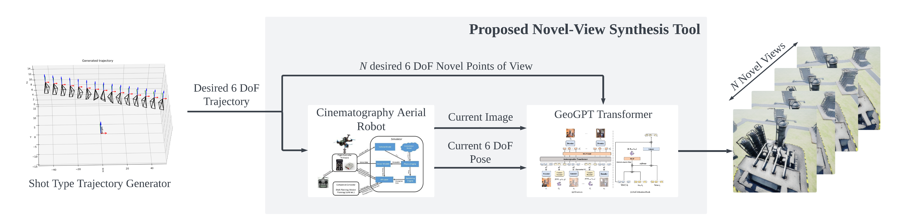
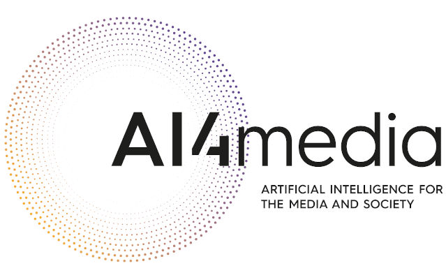

# Photoconsistent and Trajectory Guided Novel-View Synthesis Tool for UAV Cinematography Based on Autoregressive Transformers

> Novel view synthesis is the task of generating new images that render an object or scene from a different viewpoint than the one given. It aims to create new views of a specific subject starting from a number of pictures taken from a known points of view. The novel view synthesis problem can be approached in two different ways: as a problem of interpolation of images between two known images or extrapolation of images from one or a subset of images. During this work, the problem of the extrapolation will be addressed. Taking advantage of the fact that it is possible to pre-calculate the trajectories that we want the camera that takes the images to execute, from a series of known shot-types. Based on that and on the Autoregressive Transformers, it is presented a end-to-end tool for novel-view synthesis from previously unvisited points of view for aerial cinematography robots.



---

## Repo content overview

It contains three main folders: 

* [**airsim_dataset_generator**](./airsim_datasets_generator/README.md): It contains all the necessary tools for communicating with Airsim using Python as well as for generating trajectories or visualising them. This will simplify the task of generating datasets for computer vision.

* [**proposed_tool**](./proposed_tool/README.md): Contains the ROS nodes of the proposed tool.


## Citation

> Marco A. Montes-Grova, Vasileios Mygdalis, Francisco J. Pérez-Grau, Antidio Viguria and Ioannis Pitas. ICUAS 2024. "Photoconsistent and Trajectory Guided Novel-View Synthesis Tool for UAV Cinematography Based on Autoregressive Transformer". **_UNDER REVISION_**

If you use this data for any academic work, please cite our original paper: TBD

```bibtex
UNDER REVISION
```


## Funding

---



Supported by AI4MEDIA - A European Excellence Centre for Media, Society and Democracy.
More information: <a href="https://www.ai4media.eu/">ai4media.eu</a>

  

This project has received funding from the European Union's Horizon 2020  
research and innovation programme under grant agreement 951911.
