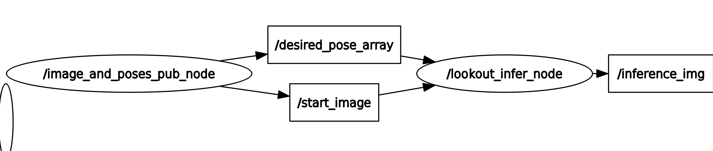

# Proposed Tool

Here it will be shown how to train and use the proposed tool for media content production in the project AI4Media.

## How to train the transformer Look-Outside-Room

First of all, its neccesary to train the first stage of this architecture, that is based in VQ-GAN encoder-decoder.

### Obtain first stage trained model on custom dataset

Follow this guide: https://github.com/CompVis/taming-transformers#training-on-custom-data.

Dont forget to modify the [model config file](https://github.com/CompVis/taming-transformers/blob/master/configs/custom_vqgan.yaml) with lookout embedding dimension and path to out dataset. 

```
model:
  base_learning_rate: 4.5e-6
  target: taming.models.vqgan.VQModel
  params:
    embed_dim: 256
    n_embed: 16384
    ddconfig:
      double_z: False
      z_channels: 256
      resolution: 256
      in_channels: 3
      out_ch: 3
      ch: 128
      ch_mult: [ 1,1,2,2,4]  # num_down = len(ch_mult)-1
      num_res_blocks: 2
      attn_resolutions: [16]
      dropout: 0.0

    lossconfig:
      target: taming.modules.losses.vqperceptual.VQLPIPSWithDiscriminator
      params:
        disc_conditional: False
        disc_in_channels: 3
        disc_start: 10000
        disc_weight: 0.8
        codebook_weight: 1.0

data:
  target: main.DataModuleFromConfig
  params:
    batch_size: 3
    num_workers: 8
    train:
      target: taming.data.custom.CustomTrain
      params:
        training_images_list_file: /home/aiiacvmllab/Documents/datasets/LookOut_UE4/train.txt
        size: 256
    validation:
      target: taming.data.custom.CustomTest
      params:
        test_images_list_file: /home/aiiacvmllab/Documents/datasets/LookOut_UE4/test.txt
        size: 256
```

To train the model, run the following command (with propper config file, name and GPU index):
```
python main.py --base configs/custom_vqgan_lookout.yaml --name custom_piramids -t True --gpus 2,
```

### Train LookOut with our format

A series of wrappers have been created to load the data into the model in the format generated by the simulator, which is much simpler than those generally used. The format to be used when using a custom dataset is the one generated by [airsim_dataset_generator](../airsim_datasets_generator/README.md). Note that the yaml configuration file must be opened to set the paths to the models for the images encoder-decoder (first stage).

```
torchrun --nproc_per_node=1 --master_port=14900 main.py --dataset custom --name exp_multitask_pyramids --base ./configs/custom/custom_16x16_sine_cview_adaptive.yaml --data_path /home/aiiacvmllab/Documents/datasets/LookOut_Piramids_UE4/ --batch_size 1 --gpu 0
```

## Usage of the tool with ROS nodes

Using the following ROS launch file: [lookout_infer.launch](https://github.com/mgrova/Look-Outside-Room/blob/ros_node/ros/launch/lookout_infer.launch), the proposed tool can be executed. Make sure to set all parameters to those that fit your data and needs. 

Using this launch file, two different nodes will be executed:

* [**image_and_poses_pub_node**](https://github.com/mgrova/Look-Outside-Room/blob/ros_node/ros/scripts/image_and_poses_pub_node.py): Regarding the poses from which you want to synthesise new views, it will read text files in the [predefined format](../airsim_datasets_generator/README.md#dataset-format) and publish them in a ROS topic (defined in the launch file) of type [PoseArray](http://docs.ros.org/en/noetic/api/geometry_msgs/html/msg/PoseArray.html). Regarding the initial image, it will also be read from a local path and published throw a ROS topic (defined in the launch file) of type [Image](http://docs.ros.org/en/noetic/api/sensor_msgs/html/msg/Image.html).

* [**lookout_infer_node**](https://github.com/mgrova/Look-Outside-Room/blob/ros_node/ros/scripts/lookout_infer_node.py): It will synchronously subscript to previously defined topics and synthesise a series of novel views according to the size of the PoseArray received. These will be published in a ROS topic (defined in the launch file) [Image](http://docs.ros.org/en/noetic/api/sensor_msgs/html/msg/Image.html) of type during the inference.

Below is shown the ROS nodes diagram:


